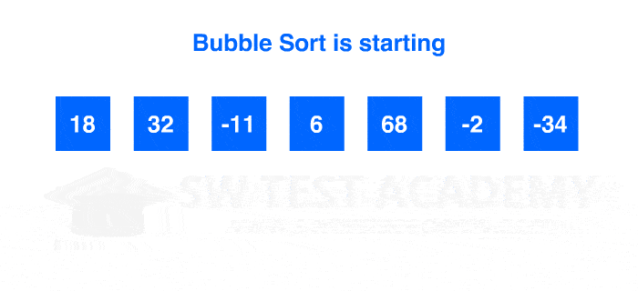

# Sorting-Searching-Algo

# Important Sorting Algorithms :-
# 1. History Of C++ 
# 2. Features of C++ 
# 3. OOP'S 
# 4. Classes & Object
# 5. Types of Variables 
# 6. Identifiers,Constents,Keywords
# 7. Header Files
# 8. Functions
# 9. Inline Function
# 10. Classes & Structures
 

